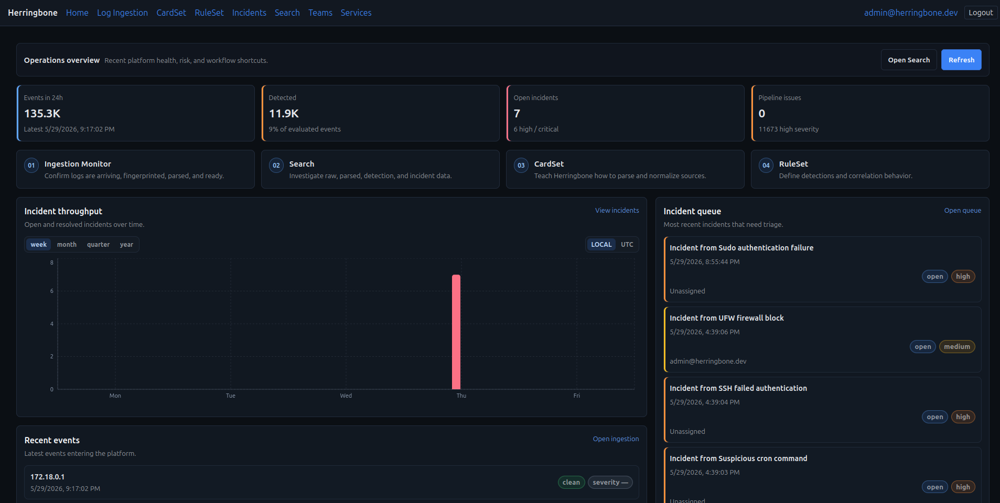

# Herringbone

**Herringbone** is a modular SIEM and log management platform built from small, independently deployable services.

It is designed for teams that want flexible log ingestion, parsing, search, detection, incident creation, and enrichment without being locked into a giant all-or-nothing platform.

Herringbone can run as a full stack, or you can run only the pieces you need.



## What Herringbone Does

Herringbone helps you collect, parse, search, detect, and respond to security-relevant logs.

Core capabilities include:

- Log ingestion over TCP, UDP, and HTTP
- Parser cards for turning raw logs into structured events
- Search APIs for querying stored logs
- Detection rules and detection results
- Incident creation and correlation
- Service-to-service authentication
- Optional enterprise features for organizations, contexts, and multi-tenant deployments
- Optional AI-assisted enrichment and classification workflows

## How It Is Organized

Herringbone is built from independent services called **elements**.

An element is a single service with one job. Examples include:

- `logingestion-receiver`
- `parser-extractor`
- `parser-cardset`
- `herringbone-search`
- `detectionengine-ruleset`
- `detectionengine-detector`
- `incidents-orchestrator`
- `herringbone-auth`

Related elements are grouped into **units**. Units are a way to organize the platform, not a requirement that everything must be deployed together.

For example, the Detection Engine unit includes services for managing rules and evaluating logs against those rules.

## Core vs Enterprise

Herringbone supports two deployment modes.

### Core

Core is the free/single-context deployment. It is meant for local deployments, labs, small environments, and users who want the basic Herringbone pipeline without enterprise organization management.

### Enterprise

Enterprise adds organization and context-aware behavior for multi-tenant or customer-facing deployments.

Enterprise mode is intended for MSPs, hosted deployments, and environments where multiple organizations or customers need to share the same Herringbone platform safely.

## Deployment

Herringbone is container-first.

Development and testing commonly use Docker Compose. Production deployments may use Kubernetes or another container orchestration platform.

The included `hbctl` tool is the recommended way to manage local Compose-based deployments.

Common commands:

```bash
hbctl start --all
hbctl status
hbctl stop --all
hbctl upgrade --all
```

Enterprise mode:

```bash
hbctl start --all --enterprise
hbctl upgrade --all --enterprise
```

Receivers are managed separately so each receiver can keep its own port and deployment shape:

```bash
hbctl receiver start --type udp --port 7004
```

## Getting Started

For setup and usage documentation, see the project wiki:

https://github.com/herringbonedev/Herringbone/wiki

A typical local workflow is:

```bash
hbctl start --all
hbctl receiver start --type udp --port 7004
hbctl status
```

Then send logs to the receiver and use the UI or APIs to inspect parsed events, search results, detections, and incidents.

## Project Goals

Herringbone is built around a few practical goals:

- Keep services small and understandable
- Allow individual components to scale independently
- Avoid forcing users into one deployment model
- Make log parsing and detection workflows easy to extend
- Support both simple single-context deployments and larger enterprise deployments
- Keep operational control in the hands of the user

## Status

Herringbone is under active development.

APIs, service boundaries, and deployment files may change between alpha releases. Use the release notes and wiki for upgrade guidance.

## Contributing

Contributions are welcome.

Please read the [Contributing guide](./CONTRIBUTING.md) before submitting issues or pull requests.

## License

Herringbone is released under the [Apache 2.0 License](LICENSE).